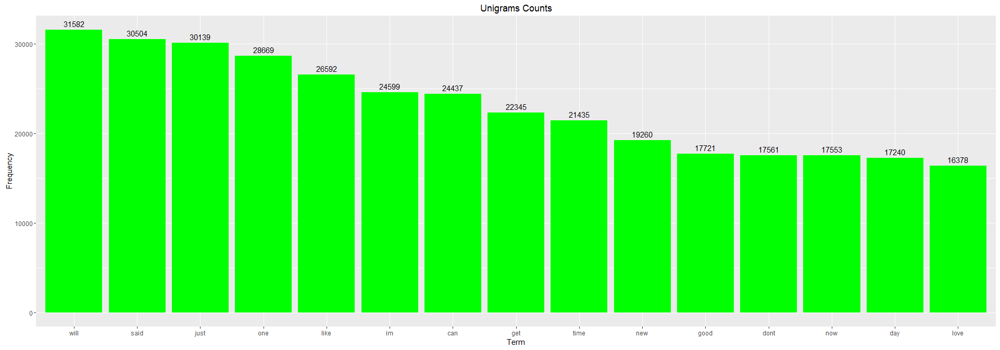
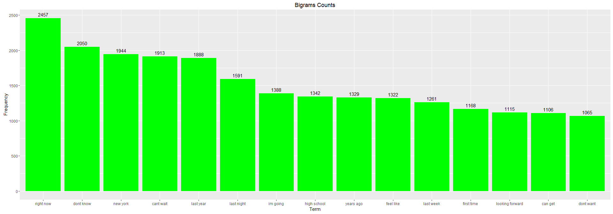
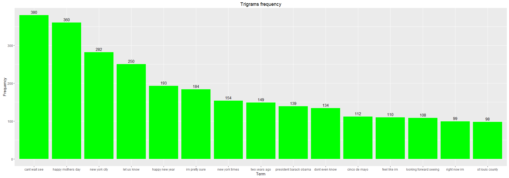

# Data Science Capstone Milestone Report
Sheng Xu  

#Introduction
This is the milestone report for the Coursera Data Science Capstone Project. The goal of the project is to build a predictive text application that will predict SwifKey data, very similar to smart phone keyboards today which are implemented using Swiftkey's technology. The application comprises of two parts, the prediction algorithm and a Shiny app UI. we will be using the English database.

In this report we will highlight the results of some exploratory data analysis and detail the next steps to complete the application.

#Data 

##Description of Data
The [HC Corpora][1] dataset is comprised of the output of crawls of news sites, blogs and twitter. A readme file with more specific details on how the data was generated can be found [here][3]. The dataset contains 3 files across four languages (Russian, Finnish, German and English). This project will focus on the English language datasets. The names of the data files are as follows:

+ en_US.blogs.txt
+ en_US.twitter.txt
+ en_US.news.txt

##Raw Data Summary

Below you can find a summary of the three input files. The numbers have been calculated by using the `wc` command.


```
##      File   Lines LinesNEmpty     Chars CharsNWhite TotalWords
## 1   blogs  899288      899288 206824382   170389539   37570839
## 2    news   77259       77259  15639408    13072698    2651432
## 3 twitter 2360148     2360148 162096241   134082806   30451170
```

##Load Data & Sample

Next, we need to load the data into R so we can start manipulating. We use readLines to load blogs and twitter, but we load news in binomial mode as it contains special characters.


```r
# Set the correct working directory
setwd("C:/R/data//en_US")

# Read the blogs and twitter files
source.blogs <- readLines("en_US.blogs.txt", encoding="UTF-8")
source.twitter <- readLines("en_US.twitter.txt", encoding="UTF-8")

# Read the news file. using binary mode as there are special characters in the text
con <- file("en_US.news.txt", open="rb")
source.news <- readLines(con, encoding="UTF-8")
close(con)
rm(con)
```

Now that we have loaded the raw data, we will take a sub sample of each file, because running the calculations using the raw files will be really slow. To take a sample we use a binomial function. Essentially, we flip a coin to decide which lines we should include. We decide to include 1% of each text file.


```r
setwd("C:/R/data//en_US")

# Binomial sampling of the data and create the relevant files
sample.fun <- function(data, percent)
{
  return(data[as.logical(rbinom(length(data),1,percent))])
}

# Remove all non english characters as they cause issues down the road
source.blogs <- iconv(source.blogs, "latin1", "ASCII", sub="")
source.news <- iconv(source.news, "latin1", "ASCII", sub="")
source.twitter <- iconv(source.twitter, "latin1", "ASCII", sub="")

# Set the desired sample percentage
percentage <- 0.1

sample.blogs   <- sample.fun(source.blogs, percentage)
sample.news   <- sample.fun(source.news, percentage)
sample.twitter   <- sample.fun(source.twitter, percentage)

dir.create("sample", showWarnings = FALSE)

write(sample.blogs, "sample/sample.blogs.txt")
write(sample.news, "sample/sample.news.txt")
write(sample.twitter, "sample/sample.twitter.txt")

remove(source.blogs)
remove(source.news)
remove(source.twitter)
```


## Create & Clean a Corpus

In order to be able to clean and manipulate our data, we will create a corpus, which will consist of the three sample text files


```r
library(tm)
library(RWeka)
library(SnowballC)
sample.corpus <- c(sample.blogs,sample.news,sample.twitter)
my.corpus <- Corpus(VectorSource(list(sample.corpus)))
```

Now that we have our corpus item, we need to clean it. In order to do that, we will transform all characters to lowercase, we will remove the punctuation, remove the numbers and the common english stopwords (and, the, or etc..)


```r
my.corpus <- tm_map(my.corpus, content_transformer(tolower))
my.corpus <- tm_map(my.corpus, removePunctuation)
my.corpus <- tm_map(my.corpus, removeNumbers)
my.corpus <- tm_map(my.corpus, removeWords, stopwords("english"))
```

We also need to remove profanity. To do that we will use the google badwords database.


```r
setwd("C:/R/data//en_US")
googlebadwords <- read.delim("google_bad_words.txt",sep = ":",header = FALSE)
googlebadwords <- googlebadwords[,1]
my.corpus <- tm_map(my.corpus, removeWords, googlebadwords)
```

Finally, we will strip the excess white space


```r
my.corpus <- tm_map(my.corpus, stripWhitespace)
```

Before moving to the next step, we will save the corpus in a text file so we have it intact for future reference.


```r
setwd("C:/R/data//en_US//output")
writeCorpus(my.corpus, filenames="my.corpus.txt")
my.corpus <- readLines("my.corpus.txt")
```

# Data Analysis

## 1.Unigram Analysis

The first analysis we will perform is a unigram analysis. This will show us which words are the most frequent and what their frequency is. To do this, we will use the Ngrams_Tokenizer that Maciej Szymkiewicz kindly made public. We will  pass the argumemnt 1 to get the unigrams. This will create a unigram Dataframe, which we will then manipulate so we can chart the frequencies using ggplot.


```r
setwd("C:/R/final")
library(ggplot2)
library(ngram)
source("Ngrams_Tokenizer.R")
unigram.tokenizer <- ngram_tokenizer(1)
wordlist <- unigram.tokenizer(my.corpus)
unigram.df <- data.frame(V1 = as.vector(names(table(unlist(wordlist)))), V2 = as.numeric(table(unlist(wordlist))))
names(unigram.df) <- c("word","freq")
unigram.df <- unigram.df[with(unigram.df, order(-unigram.df$freq)),]
row.names(unigram.df) <- NULL
save(unigram.df, file="unigram.Rda")
```


```r
ggplot(head(unigram.df,15), aes(x=reorder(word,-freq), y=freq)) +
  geom_bar(stat="Identity", fill="green") +
  geom_text(aes(label=freq), vjust = -0.5) +
  ggtitle("Unigrams Counts") +
  ylab("Frequency") +
  xlab("Term")
```

<!-- -->

## 2.Bigram Analysis

Next, we will do the same for Bigrams, i.e. two word combinations. We follow exactly the same process, but this time we will pass the argument 2.


```r
bigram.tokenizer <- ngram_tokenizer(2)
wordlist <- bigram.tokenizer(my.corpus)
bigram.df <- data.frame(V1 = as.vector(names(table(unlist(wordlist)))), V2 = as.numeric(table(unlist(wordlist))))
names(bigram.df) <- c("word","freq")
bigram.df <- bigram.df[with(bigram.df, order(-bigram.df$freq)),]
row.names(bigram.df) <- NULL
setwd("C:/R/data/en_US/output")
save(bigram.df, file="bigram.Rda")
```


```r
ggplot(head(bigram.df,15), aes(x=reorder(word,-freq), y=freq)) +
  geom_bar(stat="Identity", fill="green") +
  geom_text(aes(label=freq), vjust = -0.5) +
  ggtitle("Bigrams Counts") +
  ylab("Frequency") +
  xlab("Term")
```

<!-- -->

## 3.Trigram Analysis

Finally, we will follow exactly the same process for trigrams, i.e. three word combinations.


```r
trigram.tokenizer <- ngram_tokenizer(3)
wordlist <- trigram.tokenizer(my.corpus)
trigram.df <- data.frame(V1 = as.vector(names(table(unlist(wordlist)))), V2 = as.numeric(table(unlist(wordlist))))
names(trigram.df) <- c("word","freq")
trigram.df <- trigram.df[with(trigram.df, order(-trigram.df$freq)),]
row.names(trigram.df) <- NULL
save(trigram.df, file="trigram.Rda")
```


```r
ggplot(head(trigram.df,15), aes(x=reorder(word,-freq), y=freq)) +
  geom_bar(stat="Identity", fill="green") +
  geom_text(aes(label=freq), vjust = -0.5) +
  ggtitle("Trigrams frequency") +
  ylab("Frequency") +
  xlab("Term")
```

<!-- -->


# Next Steps

Now that we have performed some exploratory analysis, and built some preliminary n-gram models, a potential strategy for the final product would be using the n-gram model with a frequency look-up table combined with a back-off technique. Depending on the available time some stemming might be considered in the data preprocessing.

For the user interface, the current plan is to create a Shiny app with a simple user interface for text input and display a list of suggested "next" words based on our prediction model.
